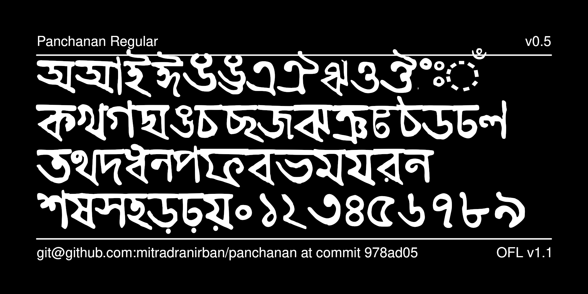

---
#Panchanan

##A project for digital revival of the first Bengali typeface created by Panchanan Karmakar in 1778

[Panchanan Karmakar (Mallick)](https://en.wikipedia.org/wiki/Panchanan_Karmakar) (died c. 1804) was an Indian Bengali inventor, born at Tribeni, Hooghly, Bengal Presidency, British India. He assisted Sir Charles Wilkins in creating the first Bangla typeface in 1778. It was used for printing A Grammar of Bengali Language by Nathaniel Brassey Halhed. 

Later in 1799 he left East India Company Press and joined Missionary Press in Serampore, where along with Bengali he also  developed typefaces in 14 languages, including Devanagari, Arabic, Persian, Marathi, Telegu, Burmese and Chinese. He made the Serampore Missionary press the largest multiscript foundry in Asia in early 19th Century. He also trained the next generation of punch-cutters, pioneering the typographic legacy of India.

This project is a tribute to Panchanan Karmakar by digitalisation of world's first Bangla Typeface he helped creating.

