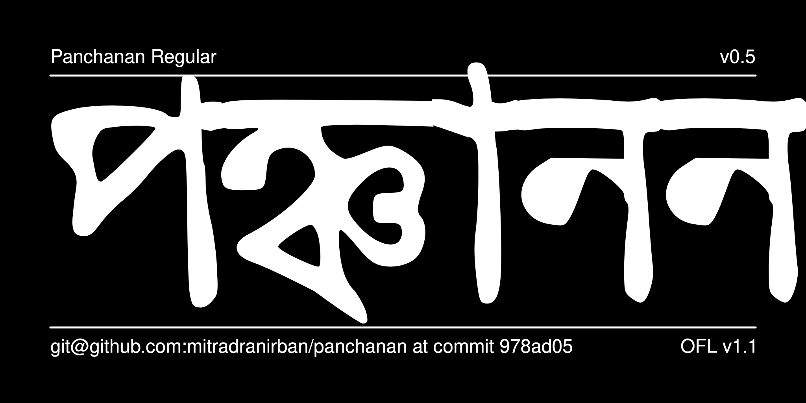

#Panchanan
##A project for digital revival of first Bengali typeface created by Panchanan Karmakar in 1778

Panchanan Karmakar (Mallick) (died c. 1804) was an Indian Bengali inventor, born at Tribeni, Hooghly, Bengal Presidency, British India. He assisted Sir Charles Wilkins in creating the first Bangla typeface in 1778. It was used for printing A Grammar of Bengali Language by Nathaniel Brassey Halhed. 

Later on he joined Serampore Missionary Press, where along with Bengali he also designed Devanagari, Arabic and Persian typefaces. He made the Serampore Missionary press the largest multiscript foundry in Asia in early 19th Century.

This project is a tribute to Panchanan Karmakar by digital revival of world's first Bangla Typeface designed by him.

